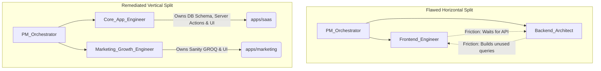

# Remediation Architecture Map

Visualizing the transition from the flawed, skeptic-identified architecture to the remediated, vertically-integrated state.

---

## 1. Remediation: Agent Verticalization

**The Flaw:** Splitting teams into `Frontend_Engineer` and `Backend_Architect` causes circular dependencies in Next.js 16, as Server Components naturally blend frontend UI with backend data fetching.

**The Fix:** Transitioning to Domain/Vertical ownership.



---

## 2. Remediation: Monorepo Decoupling

**The Flaw:** Forcing all database queries into `packages/db` and all auth logic into `packages/auth` creates a circular dependency (Auth needs DB to check sessions, DB needs Auth to filter tenant data).

**The Fix:** `packages/db` only holds the *raw schema* and connection. Domain logic and Server Actions are pushed to the edges (`apps/saas`).

```mermaid
graph TD
    subgraph Flawed Monorepo Constraints
        AUTH_PKG[packages/auth]
        DB_PKG[packages/db<br/>(Holds schemas + all queries)]
        SAAS_APP[apps/saas]
        
        AUTH_PKG -- "Requires DB for Sessions" --> DB_PKG
        DB_PKG -- "Requires Auth for RLS/Tenant Filter" --> AUTH_PKG
        SAAS_APP --> AUTH_PKG
        SAAS_APP --> DB_PKG
    end

    subgraph Remediated Decoupled Flow
        RAW_DB[packages/db<br/>(Raw Schema Only)]
        RAW_AUTH[packages/auth<br/>(Auth config only)]
        
        SAAS_DOMAIN[apps/saas<br/>(Owns Domain Server Actions)]
        MKT_DOMAIN[apps/marketing<br/>(Owns Marketing Server Actions)]
        
        SAAS_DOMAIN -- "Imports raw schema" --> RAW_DB
        SAAS_DOMAIN -- "Imports auth context" --> RAW_AUTH
        
        MKT_DOMAIN -- "Imports raw schema" --> RAW_DB
    end
```
